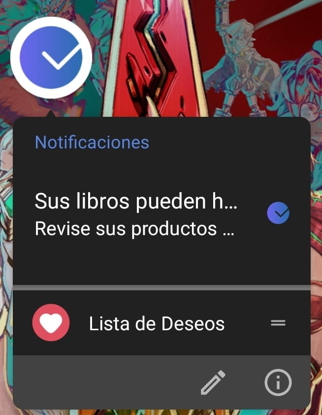

<h1 align="center">Sky Scrapper App</h1>
  <p align="center">
 Es el modulo web del sistema de API Rest
 <a href="https://github.com/SkyZeroZx/Sky-Scrapper-API" target="_blank"> Sky-Scrapper-API en NestJS </a> 
  Para comprar precios de las principales tiendas de mangas en Perú haciendo uso de graficos de variaciones de precios diarios con alertas de cambio de precios
 </p>

_Adicionalmente funciona como PWA(Progresive Web App) que puede integrarse en cualquier dispositivo movil_

<small>
Nota : Este es un proyecto con fines educativos sin fines de lucro
</small>


## :ledger: Index

- [Pre-Requisitos](#pre-requisitos-)
- [Instalación](#instalación-)
- [PWA](#ejecutando-como-pwa-)
- [Despligue](#despliegue-)
  - [Build](#build)
  - [Docker](#docker)
- [Analisis de Codigo](#analisis-de-codigo-)
- [Construido](#construido-con-)

## Comenzando 🚀

_Estas instrucciones te permitirán obtener una copia del proyecto en funcionamiento en tu máquina local para propósitos de desarrollo y pruebas._

Puede visualizar una Demo del Proyecto en el siguiente enlace : https://sky-scrapper.skyzerozx.com

Mira **Deployment** para conocer como desplegar el proyecto.

### Pre-requisitos 📋

_Software requerido_

```
NodeJS >= 14.X
NPM >= 8.X
AngularCli >= 14.X
```

_Software opcional_

```
Visual Studio Code ( O el editor de su preferencia)
```

### Instalación 🔧

_Para ejecutar un entorno de desarrollo_

_Previamente ejecutar el comando en la terminal para descargar "node_modules" para el funcionamiento del proyecto_

```
npm install
```

_Previamente configurar la ruta del API que consumira nuestro proyecto en el archivo **"src/environments/environment.ts"** campo **API_URL**_

_Para ejecutar un servidor de pruebas local usar el comando donde **"PUERTO"** sera el puerto donde deseamos ejecutar el proyecto , por default **ng serve** ejecuta el puerto 4200_

```
ng serve --port [PUERTO]
```

_Dirigirse a la ruta http://localhost:4200/#/login/ se tendra la pantalla de Login del sistema_

_Puede visualizar una demo en funcionamiento en el siguiente video que detalla los diferentes modulos_


https://user-images.githubusercontent.com/73321943/213350821-224f0e70-c8fa-42a9-a4e0-38b1531f3ae3.mp4


## Ejecutando como PWA 👨🏻‍💻

_Para ejecutar como PWA(Progressive Web App) , previamente debe tenerse instalado la libreria http-serve_

```
npm install --global http-server
```

_Una vez instalada proceder a ejecutar el siguiente comando , que nos permite ejecutar en entorno local nuestra PWA_

```
npm run start-pwa
```

_Este comando se encuentra configurado en el archivo *package.json de la raiz del proyecto por default ejecuta el puerto 8080*_

_La PWA se encuentra configurada para ejecutarse en la vista de Login si no se esta logeado_

_Se cuenta con soporte de notificaciones Push integrado tanto para escritorio como dispositivos moviles_

_Se creo el archivo `custom-service-worker.js` para la gestion de evento de notificaciones personalizado_

<p align="center">

</p >


## Despliegue 📦

### Build

_Previamente configurar la ruta del API que consumira nuestro proyecto en el archivo src/environments/environment.prod.ts campo API_URL_

_Para realizar el despligue a produccion del proyecto ejecutar el siguiente comando_

```
ng build --configuration production
```

_El cual creara la carpeta "dist" en la raiz de nuestro proyecto el cual podemos desplegar en cualquier servidor que ejecute HTML CSS y JS_

_A su vez en un hosting con certificado HTTPS se podra ejecutar como una PWA que se podra "instalar"_

### Docker

_Para desplegar el proyecto mediante Docker se tiene los archivos `Dockerfile` y `docker-compose.prod.yaml`, los cuales tienen preconfigurado la imagen y dependencias necesarias para levantar el proyecto, se utilizo como base un servidor web Nginx_

_Para construir la imagen y ejecutarla tenemos el siguiente comando_

_Ejecutar el siguiente comando en la raiz del proyecto_

```
 docker-compose -f docker-compose.prod.yaml up --build
```


_En caso de requerir volver a ejecutar el contenedor del proyecto previamente creado ejecutar el comando:_

```
 docker-compose -f docker-compose.prod.yaml up
```

## Analisis de Codigo 🔩

_**Pre requisitos**_

_En la raiz del proyecto se tiene el archivo *sonar-project.properties* el cual tiene las propiedades necesarias para ejecutarlo sobre un SonarQube_

_Configurar los apartados : *sonar.host.url* , *sonar.login* *sonar.password* con los datos de su instancia correspondiente o usar SonarCloud con su token correspondiente_

```
Sonaqube >= 9.X
```


_Las pruebas fueron realizas sobre *SonarQube 9.5* para ejecutar el analisis de codigo ejecutar el comando para la instancia local:_

```
npm run sonar
```

_Reporte de Cobertura en SonarQube_


## Construido con 🛠️

_Las herramientas utilizadas son:_

- [Angular](https://angular.io/docs) - El Framework para Desarrollo Web
- [NPM](https://www.npmjs.com/) - Manejador de dependencias
- [Docker](https://www.docker.com/) - Para el despliegue de aplicaciones basado en contenedores
- [Nginx](https://www.nginx.com/) - Servidor de Proxy Inverso ligero
- [TailwindCSS](https://tailwindui.com/) -Framework de CSS de código abierto​ para el diseño de páginas web
- [Visual Studio Code](https://code.visualstudio.com/) - Editor de Codigo
- [SonarQube](https://www.sonarqube.org/) - Evaluacion de codigo on premise
- [Prettier](https://prettier.io/) - Formateador de Codigo
- [TabNine](https://www.tabnine.com/) - Autocompletador de Codigo
- [WebAuthn](https://webauthn.guide/) - Estándar web del proyecto FIDO2 de la Alianza FIDO

## Versionado 📌

Usamos [GIT](https://git-scm.com/) para el versionado.

## Autor✒️

- **Jaime Burgos Tejada** - _Developer_
- [SkyZeroZx](https://github.com/SkyZeroZx)
- Email : jaimeburgostejada@gmail.com

## Licencia 📄

Este proyecto está bajo la Licencia - mira el archivo [LICENSE.md](LICENSE.md) para detalles
